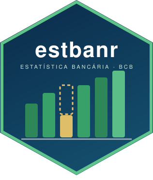

# estbanr 

<!-- badges: start -->
[](https://github.com/StrategicProjects/estbanr/actions/workflows/R-CMD-check.yaml)
[](https://CRAN.R-project.org/package=estbanr)
[](https://github.com/StrategicProjects/estbanr)
<!-- badges: end -->

**estbanr** downloads, reads and tidies **ESTBAN** (*Estatística Bancária
Mensal por Município*), the monthly banking statistics that the Brazilian
Central Bank publishes for every bank branch and municipality in Brazil:
about 45 balance-sheet accounts of the COSIF chart (credit operations,
financing, rural credit, savings and time deposits, ...) since 1988. It is
the only public source of credit and deposits at the municipal level.

| Step | Function |
|:---|:---|
| Find the file name for a month (the naming changed over the years) | `estban_url()` |
| Download with an idempotent local cache | `estban_download()` |
| Read the Latin-1 CSV into a typed tibble, optionally one state | `estban_read()` |
| Download and read a range of months | `estban_fetch()` |
| Column layout and COSIF account dictionary | `estban_columns()`, `estban_verbetes()` |
| Detect and impute **non-reported** institution-months | `estban_flag_nonreport()`, `estban_impute_nonreport()` |
| Aggregate to the municipality (wide or long) | `estban_by_municipality()` |

<table class="important-banner"><tr><td>
&#x2755; <strong class="important-title">Disclaimer</strong><br>
This package is a client for public files published by the Banco Central do
Brasil (BCB), which is the institution responsible for the data. Function
names and arguments are in English; column names follow the source files
(Portuguese, converted to <code>snake_case</code>), and account
descriptions are in Portuguese as published. The official page is
<a href="https://www.bcb.gov.br/estatisticas/estatisticabancariamunicipios">Estatística Bancária por Município</a>.
</td></tr></table>

## Installation

```r
# From CRAN (when available):
install.packages("estbanr")

# Development version:
# remotes::install_github("StrategicProjects/estbanr")
```

## Quick start

```r
library(estbanr)

# Persistent cache (optional; the default is a folder under tempdir())
options(estbanr.cache_dir = "~/data/estban")

# One year of Pernambuco, one row per branch
x <- estban_fetch(202301, 202312, uf = "PE")

# Which account is which
v <- estban_verbetes()
v[v$code %in% c(160, 420, 432), c("name", "codes", "side")]

# Municipal totals, with non-reported institution-months interpolated
m <- estban_by_municipality(x)
m[, c("municipio", "ref", "verbete_160_operacoes_de_credito")]
```

Everything can be tried offline with the small real extract shipped in
`inst/extdata/` (Pernambuco and Paraíba, January 2024):

```r
f <- system.file("extdata", "202401_ESTBAN_AG_sample.CSV", package = "estbanr")
estban_read(f, uf = "PE")
```

## Why the non-report tools exist

Once in a while a bank's monthly return does not make it into the ESTBAN
file: the bank is still listed, with every account equal to zero in every
branch of the country (Banco Santander, January to March 2025, is a
documented case). Summed into a municipal series that looks like a credit
collapse followed by a rebound. `estban_flag_nonreport()` finds those
institution-months and `estban_impute_nonreport()` fills interior gaps by
linear interpolation, never extrapolating at the edges. See
`vignette("nonreport-imputation")`.

## Related packages by the same group

[tesouror](https://github.com/StrategicProjects/tesouror) (National Treasury
APIs), [pixr](https://github.com/StrategicProjects/pixr) (Pix open data),
[comexr](https://github.com/StrategicProjects/comexr) (foreign trade),
[tceper](https://github.com/StrategicProjects/tceper) (Pernambuco Court of
Accounts), [ibger](https://github.com/StrategicProjects/ibger) (IBGE
aggregates).
